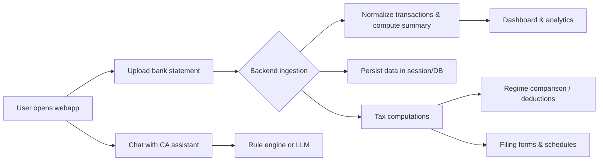

# VittaMitra

> **Your privacy-first AI-powered Indian tax co-pilot.**  
> Analyses your finances, compares tax regimes, finds missed deductions, and answers your tax questions — all locally on your Mac.


---

## Features

- **Bank Statement Ingestion** — CSV, Excel, PDF (auto-detects column formats)
- **Old vs New Regime Comparison** — Side-by-side tax breakdown with recommendation
- **Deduction Optimizer** — 80C, 80D, HRA, NPS gap analysis with saving estimates
- **Financial Dashboard** — Cash flow charts, expense pie, health score
- **CA Chat Assistant** — Rule-based or LLM-powered (OpenAI/Gemini/Ollama)
- **100% Local** — No cloud sync, no sign-up required

---

## Quick Start

### Requirements
- Python 3.11+
- Node.js 18+

### 1. Backend

```bash
cd backend
python3 -m venv .venv && source .venv/bin/activate
pip install -r requirements.txt        # see [backend/requirements.txt](backend/requirements.txt)
uvicorn main:app --reload --port 8000  # entrypoint is [backend/main.py](backend/main.py)
```

### 2. Frontend (new terminal)

```bash
cd frontend
npm install
npm run dev
```

Open **http://localhost:5173**

---

## Using Sample Data

Upload [`backend/data/sample_bank_statement.csv`](backend/data/sample_bank_statement.csv) from the **Documents** tab.  
It contains 6 months of realistic transactions for a ₹14.4L/year salaried professional.

---

## Workflow

The following diagram summarises how VittaMitra operates end‑to‑end:



### How to use

1. **Documents tab**: Drop a bank statement (CSV/XLSX/PDF) to populate your profile. The backend normalizes entries and tags categories.
2. **Dashboard**: View income, expenses, savings rate and financial health at a glance. Charts auto-update when new data is ingested.
3. **Regime Compare & Deductions**: Enter any additional deductions or adjust income, then run to see a side‑by‑side tax breakdown and savings opportunities.
4. **Tax Filing**: Fill out sub‑tabs (Form 16, Interest/Dividend, Rental, Capital Gains, NRI) to build up your ITR schedules and compute related taxes.
5. **ITR Summary**: Generate a consolidated view of all schedules ready for review or copy‑paste into the government portal.
6. **Chat Assistant**: Ask questions about sections you’re unsure of; replies come from a built‑in rule set or an LLM when API keys are configured.

Each interaction happens locally; your data never leaves the machine.


---

## LLM Chat Setup

| Provider | API Key | Base URL | Model |
|---|---|---|---|
| OpenAI | `sk-...` | *(blank)* | `gpt-4o-mini` |
| Gemini | `AIza...` | `https://generativelanguage.googleapis.com/v1beta/openai/` | `gemini-1.5-flash` |
| Ollama (local) | `ollama` | `http://localhost:11434/v1` | `llama3.2` |

Configure in the Settings panel. Chat works without a key (rule-based mode).

---

## Running Tests

*Note: the original `tests/` directory has been removed; add tests under `backend/` if needed.*

```bash
cd backend && source .venv/bin/activate
# install pytest and run whatever tests you create under backend/
```

---

## Updating Tax Rules

All slabs and limits are in [`backend/config/tax_rules.json`](backend/config/tax_rules.json).  
Edit this file for any new financial year — no code changes needed.

---

## Project Docs

| File | Purpose |
|---|---|
| [`IMPLEMENTATION.md`](IMPLEMENTATION.md) | Full deployment & architecture guide |
| [`agents.md`](agents.md) | AI agent prompt to regenerate this project |

---

> ⚠️ **Advisory only.** VittaMitra does not file taxes or provide legal advice. Always consult a licensed Chartered Accountant.
